<a name="oben"></a>


<div align="center">

# Einen Datensatz erstellen und trainieren


|[:skull:ISSUE](https://github.com/KI4kids/04_KI4Kids_Training/issues?q=is%3Aissue)|[:speech_balloon: Forum /Discussion](https://github.com/KI4kids/04_KI4Kids_Training/discussions)|[:grey_question:WiKi](https://github.com/KI4kids/04_KI4Kids_Training/blob/main/wiki.md)|
|--|--|--|
| | | | 
| <a href="https://github.com/KI4kids/04_KI4Kids_Training/pulse" alt="Activity">| <a href="https://github.com/KI4kids/04_KI4Kids_Training/graphs/traffic">  |<a href="https://github.com/frankyhub?tab=stars"> |


</div>


## Story
Künstliche Intelligenz (KI) bezeichnet die Fähigkeit von Maschinen, menschenähnliche Intelligenzleistungen zu erbringen. Das umfasst das Lernen aus Erfahrungen, das Verstehen von Sprache, das Treffen von Entscheidungen und das Lösen komplexer Probleme. Im Wesentlichen geht es darum, Computer so zu programmieren, dass sie Aufgaben erledigen können, die normalerweise menschliche Intelligenz erfordern.
Dieses Repo beschreibt das Training (Supervised Learning) einer KI zur Erkennung verschiedener Objekte. KI-Training ist ein Teil des Fablab Oberland Bildungsprogramms. Ziel ist es, einen Datensatz zu erstellen und anschließend zu trainieren um z.B. geometrische Formen zu erkennen oder eine Zahl aus einer Zahlenreihe vorauszusagen.


## Geometrische Formen erkennen


## Ablauf

• Inbetriebnahme des Raspberry Pi
• Ein Environment erstellen
• Die KI Pakete installieren
• Einen Datensatz erstellen
• Die Daten kommentieren (Annotate) und den Klassen zuweisen
• Den Datensatz splitten (Train - Valid - Test)
• Den Datensatz trainieren (KI Model)
• Den Datensatz prüfen und das Training starten
• Die trainierte Bibliothek testen
• Das Ergebnis mit fine tuning verbessern
• Trainings-Beispiele
Ein Trainingsbeispiel in google colab erstellen


---


## Linux Standard Base - Versionsabfrage
bash

```
lsb_release -a
```

| | |
|--|--|
|Distributor ID: | Debian|
|Description:|Debian GNU/Linux 12 (bookworm)|
|Relaese:|12|
|Codename:|bookworm|
| | |

---

## Anaconda 

Anaconda ist eine Python-Distribution für Datenverarbeitung von großen Mengen, vorhersagende Analyse und wissenschaftliche Berechnungen. Bestandteile des Anaconda Pakets sind NumPy, SciPy, matplotlib, pandas, IPython, Jupyter Notebook, scikit-learn und der Bibliothek Intel MKL.

### Versions-Kontrolle: https://repo.anaconda.com/archive/


### Anaconda installieren

bash
```sh
wget https://repo.anaconda.com/archive/Anaconda3-2025.06-0-Linux-aarch64.sh
```

cd tmp

bash
```sh
sh Anaconda3-2025.06-0-Linux-aarch64.sh
```

- press ENTER to continue
- q (Lizenzvereinbarungen mit q Abbrechen)
- yes (Installation in /home/khf/anaconda3)
- enter (Installing base environment)
- yes (running conda)


```diff

! *** Die Shell neu starten *** !

```


Ist Anaconda korrekt installiert?

bash

```
conda --version

```

Kontrolle:

conda 25.5.1

(base) khf@pi:~/temp $

---

### Python kontrollieren:

bash

```
python --version 
```
Python 3.13.5 

---
## Virtual Environments in Anaconda (Virtuelle Umgebungen) 

In der Softwareentwicklung, besonders in Python, gibt es den Begriff der virtuellen Umgebung oder virtual environment. Das ist eine isolierte Umgebung, in der du Software-Bibliotheken installieren kannst, ohne die globale Installation von Bibliotheken auf deinem System zu verändern. Dies ist besonders nützlich, um Versionskonflikte zwischen verschiedenen Projekten zu vermeiden.

### Das Environment training erstellen

bash

```
conda env list
```

```
conda create -n training
```

```
conda activate training
```

```
conda env list
```

### So könnte man das Environment training wieder löschen

```
conda remove -n training --all
```
---
---
## Modelle und Datensätze

### Modelle
- yolo von Ultralytics
- OpenCV von Intel
- Pytorch  wurde von Meta AI (ehemals Facebook AI Research Lab) entwickelt seit 2017 Open source
- keras von google, jetzt Open source 
- TensorFlow von google

### Datensätze
- coco von Ultralytics
- kaggle von google 
- aws von Amazon web Service
- Open X-Embodiment Dataset und 
- Open-Physical-Interaction Dataset Collection von NVIDIA


--- 

### OpenCV 

OpenCV (Open Source Computer Vision Library) wurde ursprünglich von Intel im Jahr 1999 initiiert und ist seitdem zu einer der beliebtesten Bibliotheken für Computer Vision geworden. 
Die Bibliothek wurde entwickelt, um Forschern und Entwicklern eine einfache und effiziente Möglichkeit zu bieten, Computer Vision in Echtzeitanwendungen zu integrieren.
So wurde OpenCV ein beliebtes und umfassende Model für Computervisionsaufgaben und bietet eine Vielzahl von Tools und Algorithmen für die Bild- und Videoverarbeitung, Objekterkennung und Gesichtserkennung.


pip Installer

pip install ist ein Befehl, der im Python-Paketmanager pip verwendet wird, um Python-Pakete aus dem Python Package Index (PyPI) oder anderen Quellen zu installieren. Im Wesentlichen ermöglicht er die Installation, Aktualisierung und Verwaltung von Python-Softwarepaketen.


```
conda install anaconda::pip

```
OpenCV Standardpaket installieren

```
pip install opencv-python
```

Zusätzliche OpenCV Funktionen installieren

```
pip install opencv-contrib-python
```


### USB-Kamera testen

Der Code erfasst den Videostream, der von der Kamera generiert wird, und zeigt sowohl im BGR-Farb- als auch im Graumodus an. Mit q wird er beendet.

```
cd
```
```
mkdir camtest
```
```
cd camtest
```

Python

```Python
# camtest.py
# Video mit der USB-Kamera

import numpy as np
import cv2

cap = cv2.VideoCapture(0)

while(True):
    # Bild für Bild erfassen
    ret, frame = cap.read()

    # Die Bilder im Frame
    gray = cv2.cvtColor(frame, cv2.COLOR_BGR2GRAY)
   
    # Zeige den Frame an
    cv2.imshow('frame',frame)  #In Farbe
    #cv2.imshow('gray',gray)    #In SW

    if cv2.waitKey(20) & 0xFF == ord('q'):
        break

# Programm beenden
cap.release()
cv2.destroyAllWindows()

```

```
python camtest.py
```


---

## Download der geo-Dateien

Python

```Python
#dlgeo.py

import os
import shutil
import urllib.request
import zipfile

# Wechsle in das Home-Verzeichnis 
os.chdir(os.path.expanduser("~"))

# Erstelle den Ordner geo
os.makedirs("geo", exist_ok=True)

# Wechsle in das Home-Verzeichnis 
os.chdir(os.path.expanduser("~"))


# Wechsle in den Ordner
os.chdir("geo")

# Hilfsfunktion zum Herunterladen von Dateien
def download_file(url, filename=None):
    if not filename:
        filename = url.split("/")[-1]
    print(f"Downloading {filename} ...")
    urllib.request.urlretrieve(url, filename)

# Hilfsfunktion zum Entpacken und Löschen von ZIP-Dateien
def unzip_and_remove(zip_filename):
    print(f"Unzipping {zip_filename} ...")
    with zipfile.ZipFile(zip_filename, 'r') as zip_ref:
        zip_ref.extractall(".")
    os.remove(zip_filename)

download_file("https://frankyhub.de/KI_geo/geo.zip")
unzip_and_remove("geo.zip")

download_file("https://frankyhub.de/KI_geo/geopic15.zip")
unzip_and_remove("geopic15.zip")

download_file("https://frankyhub.de/KI_geo/geopic.zip")

# Zeige den Inhalt des aktuellen Verzeichnisses
print("Inhalt von geo:")
print(os.listdir("."))

# Wechsle in das Home-Verzeichnis 
os.chdir(os.path.expanduser("~"))

```

---


# Roboflow

In Roboflow kannst du Bilder hochladen, labeln, trainieren und exportieren.

[Login roboflow](https://app.roboflow.com/login)


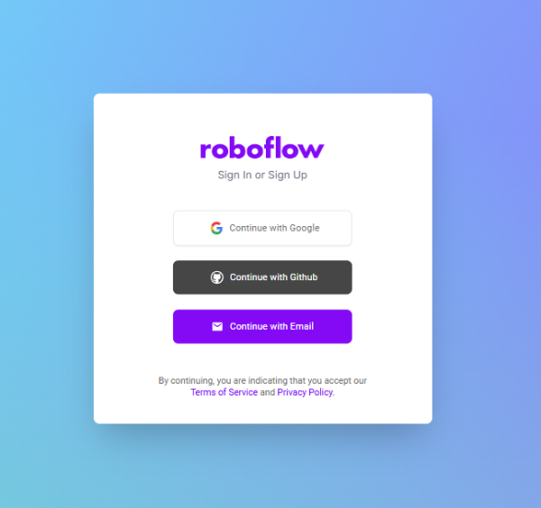


## Erstelle ein neues public Projekt

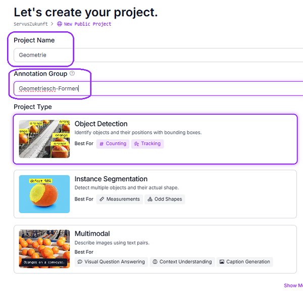

### 1. Upload Data

• Lade deine Bilder in Roboflow hoch:

• [geo_pic](https://github.com/frankyhub/04_KI4Kids_Training/blob/main/geo_pic/geo_pic.zip)


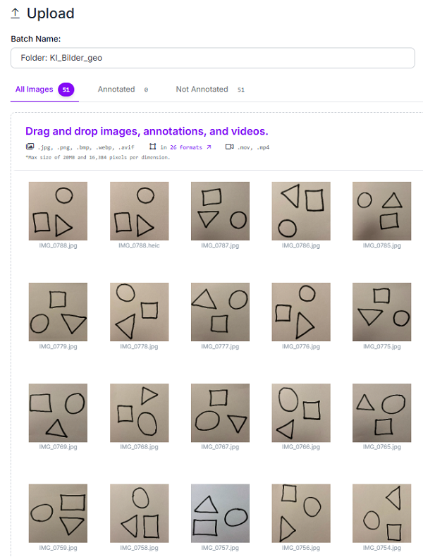
   
• Save and Continue

### Annotate 

• Start Manual Labeling

• Assign to Myself

• Annotating

• Start Annotating

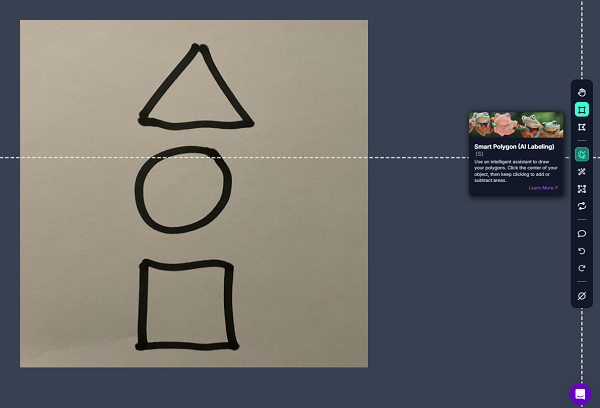

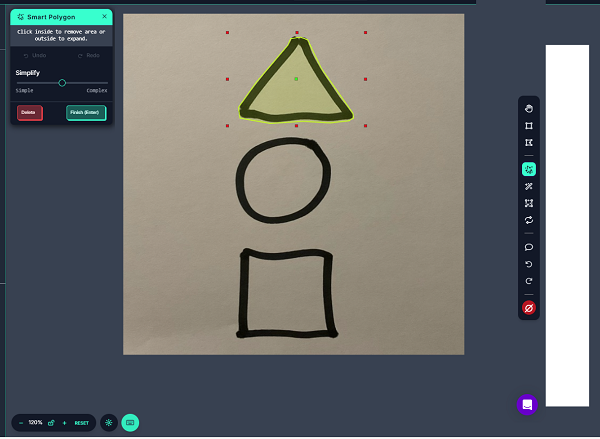

• Bestimme die Klassen

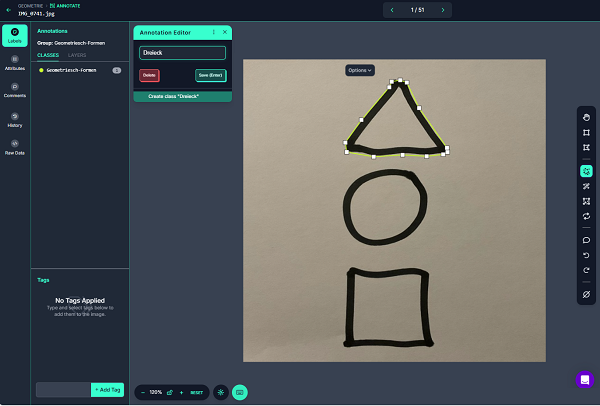


### 2. Daten aufteilen (Train/Val/Test-Split erstellen)

Roboflow ermöglicht es, deine Daten in Trainings-, Validierungs- und Testdaten aufzuteilen. Das kannst du folgendermaßen machen:

• Dataset: Add Annotated images


#### 2.1. Während der Projekterstellung

• Nach dem Hochladen der Bilder wirst du gefragt, wie du die Daten aufteilen möchtest.

• Gib den Split in Prozent an, z. B.:

• Train: 70%

• Validation (Val): 20%

• Test: 10%

• Roboflow verteilt die Bilder automatisch in die entsprechenden Sets.

Falls du die Splits nachträglich ändern möchtest:

• Gehe zu deinem Projekt-Dataset.

• Wähle „Settings“ > „Dataset Splits“.

• Passe die Prozentsätze für Train/Val/Test an.

### Split Images

Hinweis: Roboflow aktualisiert die Splits basierend auf den neuen Prozentwerten. Bereits existierende Splits werden überschrieben.

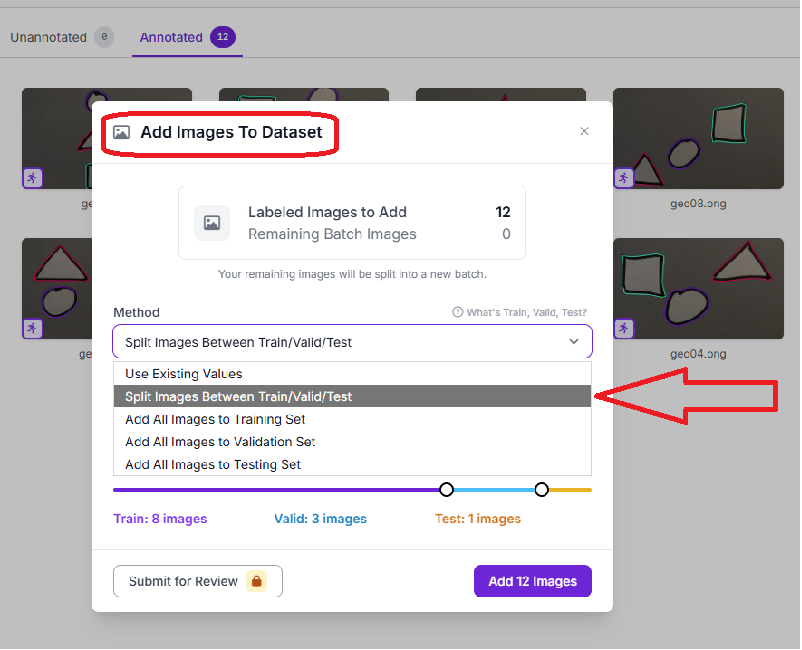

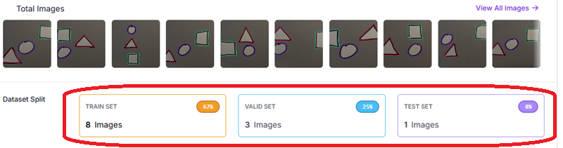


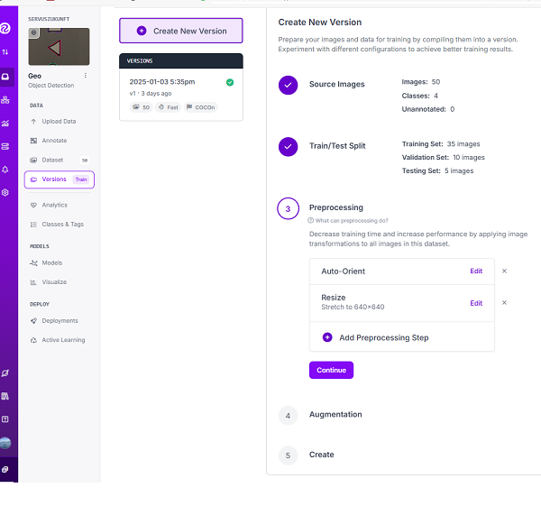

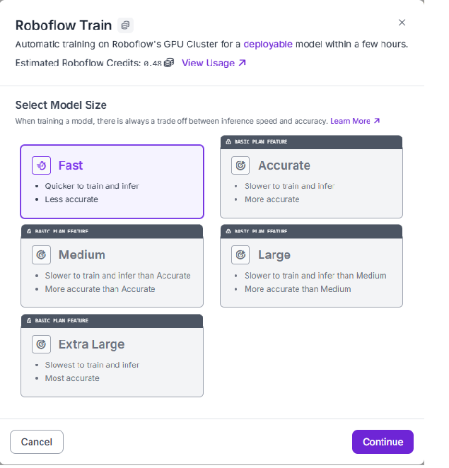

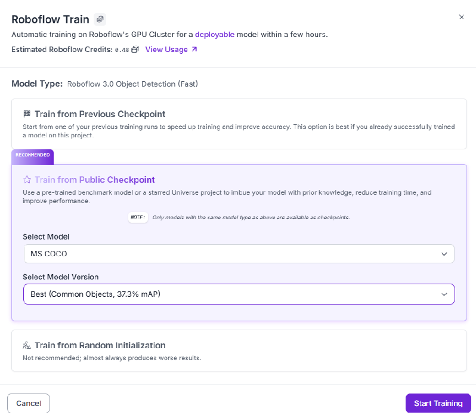


### Start Train Model


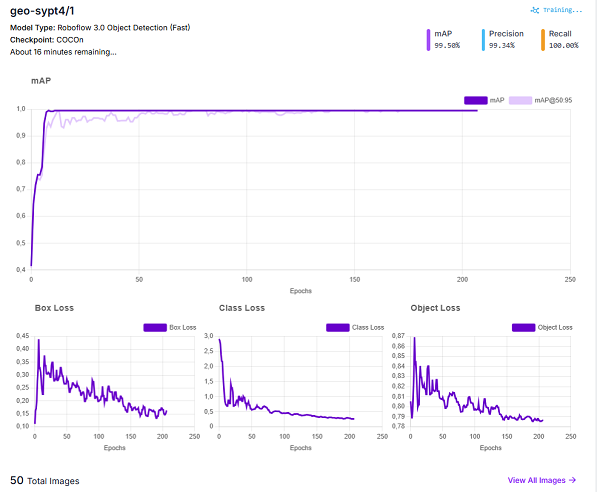

Die mittlere durchschnittliche Genauigkeit mAP (Mean Average Precision)

----

## Roboflow Export

### 1. Export aus Roboflow:

• Stelle sicher, dass der Export aus Roboflow im YOLOv8-Format erfolgt.

• Wähle beim Export „YOLOv8n PyTorch“ aus.

• Lade die ZIP-Datei herunter, die Bilder und Annotations enthält.

### 2. Struktur des Datasets:

Die Datenstruktur sollte wie folgt aussehen:

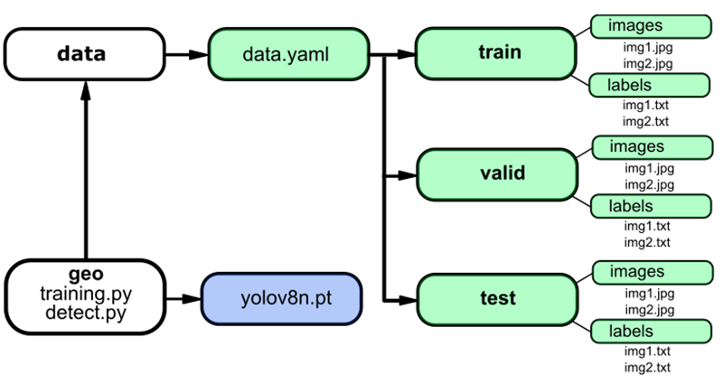


### 3. Daten korrekt einbinden:

#### 3.1. Daten entpacken und strukturieren

• Entpacke die heruntergeladene ZIP-Datei von Roboflow.

• Stelle sicher, dass die Ordnerstruktur wie oben beschrieben eingerichtet ist. Roboflow liefert oft bereits eine fertige Struktur, du musst sie nur überprüfen.

#### 3.2. data.yaml Datei erstellen

Die Datei data.yaml definiert die Pfade zu deinen Trainings- und Validierungsdaten und listet die Klassen auf. Ein Beispiel:

train: /home/khf/geo/data/train/images

val: /home/khf/geo/data/valid/images

test: /home/khf/geo/data/test/images

nc: 3
names: ['Dreieck', 'Kreis', 'Viereck']

### Erklärung

• path: Pfad zu train, val und test.

• train: Pfad zu den Trainingsbildern.

• val: Pfad zu den Validierungsbildern.

• nc: Anzahl der Klassen.

• names: Liste der Klassennamen.

### data.yaml

```
#Die Datei data.yaml

train: /home/khf/geo/data/train/images
val: /home/khf/geo/data/valid/images
test: /home/khf/geo/data/test/images

nc: 3
names: ['Dreieck', 'Kreis', 'Viereck']

```


---
---

Training und Detection

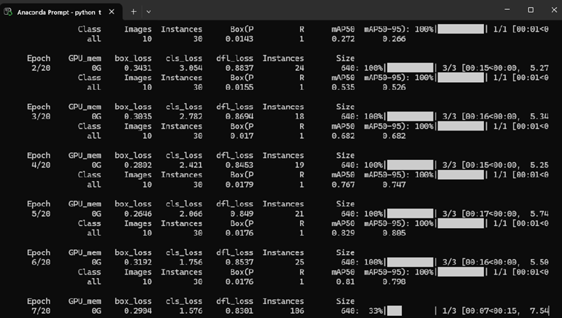


### Ultralytics installieren

```
pip install ultralytics

```


## Das Training starten mit python training.py

Python

```Python
#pip install ultralytics

# geo 
# training.py

from ultralytics import YOLO

# Load a model
model = YOLO("yolov8n.yaml")  # build a new model from scratch
model = YOLO("yolov8n.pt")  # load a pretrained model (recommended for training)

# Use the model
results = model.train(data=r"/home/khf/geo/geo.yolov8/data.yaml", epochs=100)  # train the model

```


## Die Detection starten mit python detect.py --source 0 

Python

```Python
# python detect.py --source 0 

import sys
import os
import cv2
from ultralytics import YOLO
from pathlib import Path

FILE = Path(__file__).resolve()
ROOT = FILE.parents[0]  # root directory
if str(ROOT) not in sys.path:
    sys.path.append(str(ROOT))  
    
ROOT = Path(os.path.relpath(ROOT, Path.cwd()))  


model = YOLO('/home/khf/geo/best.pt')
#model = YOLO('yolov8n.pt')


data=ROOT / "/home/khf/geo/data/data.yaml",  
 
 
print(model.names) # Klassen: Dreieck, Kreis und Viereck


webcamera = cv2.VideoCapture(0)
#webcamera.set(cv2.CAP_PROP_FRAME_WIDTH, 1200)
webcamera.set(cv2.CAP_PROP_FRAME_HEIGHT, 1080)

while True:
    success, frame = webcamera.read()
    
    results = model.track(frame, conf=0.8, imgsz=480)
    cv2.putText(frame, f"Total: {len(results[0].boxes)}", (50, 50), cv2.FONT_HERSHEY_SIMPLEX, 1, (0, 0, 255), 2, cv2.LINE_AA)
    cv2.imshow("Live Camera", results[0].plot())

    if cv2.waitKey(1) == ord('q'):
        break

webcamera.release()
cv2.destroyAllWindows()
```

## Ergebnis:

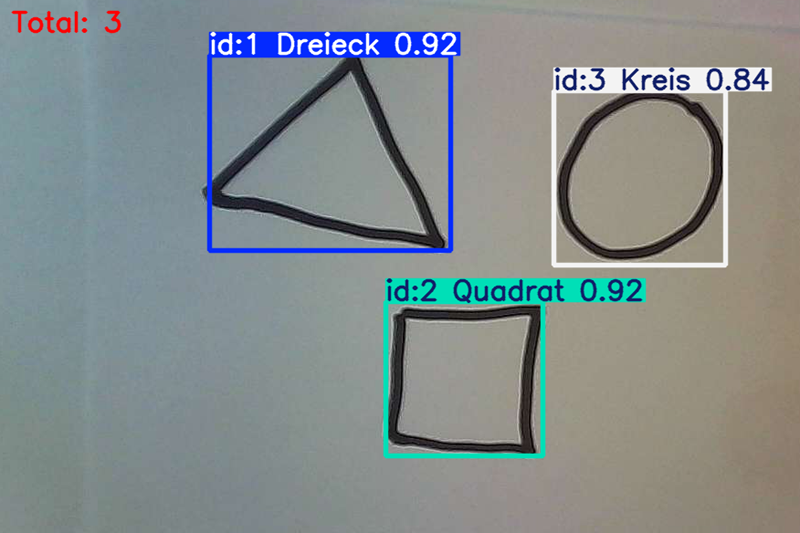

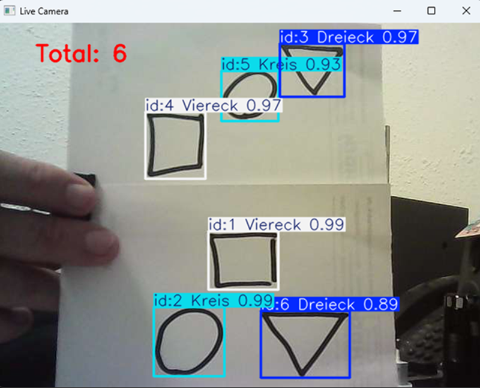


---
---
## Fine Tuning

Mit dem nachstehenden Programm erfolgt das fine tuning der best.pt, der das Ergebnis nochmals verbesssert.
Teste unterschiedliche epochs.

Python

```Python
# finetuning.py

from ultralytics import YOLO

# Lade das Model
model = YOLO("best.pt")  

# Das Model mit !!!!!!!! 3 Epochs !!!!!!!!! trainieren
results = model.train(data=r"/home/khf/geo/geo.yolov8/data.yaml", epochs=3)


```


Das fine tuning starten

```
python finetuning.py
```


## Trainingsergebnis:

Validating runs\detect\train2\weights\best.pt...

Ultralytics 8.3.102 🚀 Python-3.12.7 torch-2.6.0+cpu CPU (Intel Core(TM) i5-8400 2.80GHz)


Model summary (fused): 72 layers, 3,006,428 parameters, 0 gradients, 8.1 GFLOPs
                 Class     Images  Instances      Box(P          R      mAP50  mAP50-95): 100%|██████████| 1/1 [00:01<0
                 
all             10         30     0.0176          1       0.86      0.847

Dreieck         10         11      0.023          1      0.646      0.616

Kreis            9          9     0.0187          1       0.94       0.94

Quadrat         10         10     0.0111          1      0.995      0.983
               
Speed: 2.6ms preprocess, 95.8ms inference, 0.0ms loss, 4.2ms postprocess per image

Results saved to runs\detect\train2

---
---

## Trainings-Beispiel Helmet control

### Die benötigten Dateien downloaden

Python

```Python
#dlhelmet.py

import os
import shutil
import urllib.request
import zipfile

# Wechsle in das Home-Verzeichnis 
os.chdir(os.path.expanduser("~"))

# Erstelle den Ordner  face
os.makedirs("helmetcontrol", exist_ok=True)

# Wechsle in das Home-Verzeichnis 
os.chdir(os.path.expanduser("~"))


# Wechsle in den Ordner
os.chdir("helmetcontrol")

# Hilfsfunktion zum Herunterladen von Dateien
def download_file(url, filename=None):
    if not filename:
        filename = url.split("/")[-1]
    print(f"Downloading {filename} ...")
    urllib.request.urlretrieve(url, filename)

# Hilfsfunktion zum Entpacken und Löschen von ZIP-Dateien
def unzip_and_remove(zip_filename):
    print(f"Unzipping {zip_filename} ...")
    with zipfile.ZipFile(zip_filename, 'r') as zip_ref:
        zip_ref.extractall(".")
    os.remove(zip_filename)

download_file("https://frankyhub.de/KI_helmet_control/helmet_control.zip")
unzip_and_remove("helmet_control.zip")


# Zeige den Inhalt des aktuellen Verzeichnisses
print("Inhalt von helmetcontrol:")
print(os.listdir("."))

# Wechsle in das Home-Verzeichnis 
os.chdir(os.path.expanduser("~"))


```
### Helmet control Training

Python

```Python
#training.py
#pip install ultralytics

from ultralytics import YOLO

# Load a model
model = YOLO("yolov8n.yaml")  # build a new model from scratch
model = YOLO("yolov8n.pt")  # load a pretrained model (recommended for training)

# Use the model
#results = model.train(data=r"D:\Helmet-Detection-using-YOLOv8-main\Bike Helmet Detection.v2-more-preprocessing-augmentation.yolov8\data.yaml", epochs=100)  # train the model
results = model.train(data=r"/home/khf/helmetcontrol/helmet.yolov8/data.yaml", epochs=1)  # train the model

```
### Helmet control Detect

Python

```Python
# Helmet detect
# detect.py

from ultralytics import YOLO
model = YOLO("helmet.pt")  
#results = model("helmet.mp4", save=True, show=True)
#results = model("ub_arch.mp4", save=True, show=True)
results = model("biker.mp4", save=True, show=True)
#results = model("baustelle.mp4", save=True, show=True)

```

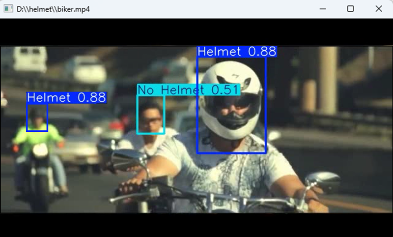

### Das Ergebis wurde als Video gespeichert:

/home/khf/helmet_control/runs/detect/predict

---
---

# Colab

## Eine Zahl vorhersagen

[](https://colab.research.google.com/drive/1VdH97RRoNZLY_h0besddK9EmTUe4N084)


## Workout-Pose training 

[](https://colab.research.google.com/drive/1RJgtf6fb8R7-KBoxLK7QmRm8yd7D4GpK#scrollTo=JgSPMX-4BSGM)

---
---

# Infos

 ## *.pt -Dateien

Gewichte (Weights) wie z. B. best.pt oder last.pt sind gespeicherte Modelle, die die Parameter (Gewichte und Biases) eines neuronalen Netzes enthalten. Sie repräsentieren den Zustand des Modells nach dem Training. Im Kontext von YOLOv5 haben diese Dateien folgende Bedeutung:

### 1. best.pt

• Dies sind die besten Gewichte, die während des Trainings erreicht wurden.

• Basierend auf der Validierungsleistung (z. B. mAP, Präzision, Recall) wird diese Datei gespeichert, sobald das Modell eine bessere Performance erzielt.

• Du kannst best.pt verwenden, um das Modell für Inferenz zu nutzen, da es die bestmögliche Leistung bietet.

### 2. last.pt

• Dies sind die Gewichte des Modells nach dem letzten Trainingsepoch.

• Es kann sein, dass diese nicht die beste Leistung repräsentieren, wenn das Modell während des Trainings zu stark angepasst wurde (Overfitting).

• Diese Datei ist nützlich, wenn du ein Training fortsetzen oder debuggen möchtest.

### 3. Wofür werden die Gewichte verwendet?

#### 3.1. Für die Inferenz (Vorhersagen)

Die Gewichte werden verwendet, um das trainierte Modell auf neue Daten anzuwenden. Zum Beispiel:

python detect.py --weights best.pt --img 640 --conf 0.5 --source path/to/images

• --weights: Gibt die Gewichtedatei an (best.pt oder eine andere .pt-Datei).

• --source: WEB-CAM, Ordner oder Datei mit Bildern/Videos, die analysiert werden sollen.

• Das Modell verwendet die gespeicherten Gewichte, um Objekte zu erkennen.

#### 3.2. Für das Fine-Tuning

Wenn du ein vortrainiertes Modell weiter trainieren möchtest, kannst du die Gewichte als Ausgangspunkt verwenden:

python train.py --img 640 --batch 16 --data data.yaml --weights best.pt

• --img 640
Legt die Bildgröße (Image Size) für das Training und die Validierung fest – in diesem Fall 640x640 Pixel. Diese Größe wird verwendet, um alle Trainingsbilder vor dem Input in das Modell zu skalieren.

• --batch 16
Gibt die Batch-Größe an, d. h. wie viele Bilder pro Schritt (Iteration) gleichzeitig durchs Netz laufen. Eine Batchgröße von 16 bedeutet, dass bei jedem Trainingsschritt 16 Bilder verarbeitet werden.


Beim maschinellen Lernen, insbesondere beim Training von Deep-Learning-Modellen, bezieht sich die Stapelgröße auf die Anzahl der Trainingsbeispiele. Anstatt den gesamten Datensatz auf einmal zu verarbeiten, was oft rechnerisch nicht machbar ist, werden die Daten in kleinere, überschaubare Gruppen oder Stapel aufgeteilt. Die Parameter des Modells werden nach der Verarbeitung jedes Stapels aktualisiert, was das Training effizienter macht, vor allem bei großen Datensätzen. Üblich sind Potenzen von 2 (z. B. 16, 32, 64, 128) aufgrund von Hardware-Optimierungen der Speicherausrichtung.

• Dies spart Rechenzeit, da das Modell bereits eine solide Grundlage hat.

### 4. Wie wird best.pt generiert?

Während des Trainings wird nach jeder Epoche die Leistung des Modells auf den Validierungsdaten evaluiert. Wenn das Modell in einer Epoche besser abschneidet als zuvor, speichert YOLOv5 die neuen Gewichte als best.pt.

Zusammengefasst:

• best.pt: Beste Leistung während des Trainings.

• last.pt: Letzte gespeicherte Gewichte am Ende des Trainings.

• Beide können für Vorhersagen oder Fine-Tuning verwendet werden.


## Mittlere durchschnittliche Genauigkeit (mAP)

Die mittlere durchschnittliche Genauigkeit (Mean Average Precision, mAP) wird verwendet, um die Leistung von Computer-Vision-Modellen zu messen. 
mAP entspricht dem Durchschnitt der Metrik "Durchschnittliche Genauigkeit" für alle Klassen in einem Modell. Sie können mAP verwenden, um sowohl 
verschiedene Modelle für dieselbe Aufgabe als auch verschiedene Versionen desselben Modells zu vergleichen. mAP wird zwischen 0 und 1 gemessen.


---
---

## coco Datensatz
In **YOLOv11** (oder in den vorherigen Versionen wie YOLOv4, YOLOv5), bezieht sich der Begriff **COCO** auf den **COCO-Datensatz (Common Objects in Context)**, der häufig für das Training und Testen von Objekterkennungsmodellen verwendet wird. Der COCO-Datensatz enthält eine große Anzahl von annotierten Bildern mit verschiedenen Objekten in realen Kontexten, was bedeutet, dass Objekte in verschiedenen Szenarien und Positionen erscheinen.

Die Aufgabe von **COCO** im Kontext von YOLO (You Only Look Once) ist in erster Linie, als **Trainings- und Testdatensatz** zu dienen. Konkret hat COCO die folgenden Aufgaben:

1. **Bereitstellung von Trainings- und Testdaten**: Der COCO-Datensatz besteht aus Millionen von Bildern und verschiedenen Objektkategorien, die genutzt werden, um Modelle wie YOLO zu trainieren. Diese Bilder enthalten unterschiedliche Objekte (z.B. Personen, Autos, Tiere) in verschiedenen Szenarien und Kontexten.

2. **Evaluation des Modells**: COCO bietet eine standardisierte Möglichkeit, die Leistung von Objekterkennungsmodellen wie YOLO zu bewerten. Es stellt Metriken wie **mAP (mean Average Precision)** zur Verfügung, die die Genauigkeit des Modells bei der Objekterkennung messen.

3. **Unterstützung bei der Modellentwicklung**: COCO ist eine wichtige Referenz, um die Fortschritte in der Objekterkennung und den allgemeinen Fortschritt von Computer Vision-Modellen wie YOLO zu verfolgen. Durch den Einsatz von COCO können Entwickler sicherstellen, dass ihre Modelle auf realistische Szenarien getestet werden.

Insgesamt wird COCO verwendet, um YOLO-Modelle auf eine breite und vielfältige Menge von Objekten und Szenarien zu trainieren, was deren Leistung und Robustheit in realen Anwendungen verbessert.

## yolo Model
**YOLO** steht für **"You Only Look Once"**. Es handelt sich um ein beliebtes und effizientes Verfahren zur **Objekterkennung** in Computer Vision. Der Name spiegelt das Hauptprinzip des Modells wider: Statt ein Bild in mehreren Schritten oder Teilen zu analysieren, erfolgt die Objekterkennung in **einem einzigen Durchgang** (also "once"), was zu einer deutlich schnelleren Verarbeitung führt.

### Kerneigenschaften von YOLO:
1. **Schnelligkeit**: YOLO kann in Echtzeit Objekte erkennen, was es besonders für Anwendungen mit niedriger Latenz und in Echtzeit (z. B. Videoüberwachung, autonomes Fahren) geeignet macht.
   
2. **End-to-End-Erkennung**: YOLO betrachtet das Bild als Ganzes und teilt es in ein Gitter auf, wobei jedes Gitter eine Bounding Box und eine Wahrscheinlichkeit für bestimmte Objekte vorhersagt. Dies bedeutet, dass das Modell in einem Schritt sowohl die Objekte als auch deren Positionen und Klassifikationen vorhersagt.

3. **Genauigkeit**: Obwohl YOLO ursprünglich nicht so präzise wie andere Modelle war (z. B. Faster R-CNN), hat sich die Genauigkeit in neueren Versionen (wie YOLOv3, YOLOv4, YOLOv5) stark verbessert, sodass es eine gute Balance zwischen Geschwindigkeit und Genauigkeit bietet.

### Funktionsweise:
- Das Bild wird in ein Gitter unterteilt.
- Jede Zelle im Gitter prediziert mehrere Bounding Boxes und deren Wahrscheinlichkeit, dass ein Objekt darin enthalten ist.
- Es wird eine einzige Vorhersage für jedes Objekt gemacht, die Position und Klassifikation gleichzeitig enthält.

YOLO hat eine Reihe von Versionen, die im Laufe der Jahre weiterentwickelt wurden, um sowohl die Leistung als auch die Genauigkeit zu verbessern.


---
---

<div style="position:absolute; left:2cm; ">   
<ol class="breadcrumb" style="border-top: 2px solid black;border-bottom:2px solid black; height: 45px; width: 900px;"> <p align="center"><a href="#oben">nach oben</a></p></ol>
</div>  

---


